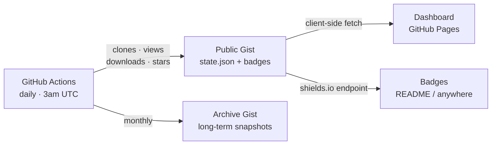

# GitHub Traffic Tracker

[![Version][version-badge]][version-url] [![Python 3.10+][python-badge]][python-url] [![License][license-badge]][license-url] [![Platform][platform-badge]][platform-url]

Zero-server GitHub traffic analytics — daily collection, permanent history, smart badges.

**Live from this repo's own tracker:**

[![Installs][installs-badge]][installs-url] [![Views][views-badge]][views-url] [![Clones][clones-badge]][clones-url]

## The Problem

GitHub's Traffic API only retains **14 days** of clone and view data. After that it's gone forever. If you don't capture it daily, you lose permanent visibility into how your project is being used. There's no built-in way to accumulate traffic history over time.

GitHub Traffic Tracker solves this with zero infrastructure via a GitHub Actions workflow that collects your data daily and stores it in a Gist, giving you permanent traffic history with no servers and no cost.

## How It Works



A GitHub Actions workflow runs daily at 3am UTC, fetching clone, view, download, star, and referrer data from the GitHub API. It merges new data into a running `state.json` stored in a public Gist, always preserving the highest values seen (merge upward, never erase). Shields.io-compatible badge JSON files are updated alongside the state. A separate unlisted Gist receives monthly archive snapshots for long-term storage. The static HTML dashboard reads directly from the Gist CDN — so again no backend needed!

## Features

- **Daily data collection** — Clones, views, downloads, stars, forks, referrers, popular paths
- **Permanent history** — Accumulates beyond the 14-day API window indefinitely
- **Unique visitor tracking** — Unique cloners and viewers alongside raw counts
- **CI clone detection** — Separates organic clones from CI/CD checkout noise
- **Cascading recency badges** — `installs 1,234 (+18 24h)` → `(+12 wk)` → `(+45 mo)`
- **Tabbed dashboard** — Overview, Installs, Views, Community, Dev tabs
- **Monthly archives** — Long-term snapshots in a separate unlisted Gist
- **Zero server** — Pure GitHub Actions + Gist storage + client-side rendering

## Quick Start

**Prerequisites:** [gh CLI](https://cli.github.com) installed and authenticated, Python 3.10+

### Option A: ghtraf CLI (recommended)

```bash
pip install github-traffic-tracker
ghtraf create --owner YOUR_ORG --repo YOUR_REPO --configure
```

### Option B: Standalone script

```bash
# Interactive — prompts for all values
python setup-gists.py

# Or fully automated
python setup-gists.py --owner YOUR_ORG --repo YOUR_REPO --configure

# Preview without making changes
python setup-gists.py --dry-run
```

Both options will:
1. Create a public badge Gist and an unlisted archive Gist
2. Set repository variables (`TRAFFIC_GIST_ID`, `TRAFFIC_ARCHIVE_GIST_ID`)
3. Guide you through creating a PAT with `gist` scope
4. Optionally configure the dashboard and workflow files (`--configure`)

After setup, copy `.github/workflows/traffic-badges.yml` to your repo, enable GitHub Pages (Settings > Pages > Deploy from branch > main, /docs), and push.

## Badge Showcase

| Badge | What it shows | Example |
|-------|--------------|---------|
| **Installs** | Downloads + clones combined, with cascading recency | `installs 1,234 (+18 24h)` |
| **Views** | Repository page views with recency | `views 5,678 (+92 24h)` |
| **Clones** | Git clones (organic, excluding CI) | `clones 890 (+7 24h)` |
| **Downloads** | Release asset downloads | `downloads 456` |

Recency cascades automatically: the badge shows the most recent non-zero period — `(+N 24h)` if there's activity today, otherwise `(+N wk)`, then `(+N mo)`. This gives visitors a sense of project activity at a glance.

```markdown
[](https://USER.github.io/REPO/stats/#installs)
```

## Live Dashboards

This system is actively running on:

- **[GitHub Traffic Tracker](https://djdarcy.github.io/github-traffic-tracker/stats/)** — This project (dogfooding since day 1)
- **[NCSI Resolver](https://dazzletools.github.io/Windows-No-Internet-Secured-BUGFIX/stats/)** — Origin project (v0.7.12)
- **[ComfyUI Triton & SageAttention](https://dazzleml.github.io/comfyui-triton-and-sageattention-installer/stats/#installs)** — First port (v0.8.3)

## Roadmap

See [ROADMAP.md](ROADMAP.md) or [Issue #1 — Roadmap](https://github.com/djdarcy/github-traffic-tracker/issues/1) for the full plan.

## Contributing

Contributions are welcome! Please read our [Contributing Guide](CONTRIBUTING.md) for details.

Like the project?

[](https://www.buymeacoffee.com/djdarcy)

## License

Github-Traffic-Tracker (ghtraf), Copyright (C) 2025 Dustin Darcy 

This project is licensed under the GNU General Public License v3.0 — see [LICENSE](LICENSE) for details.

<!-- Badge references -->

[version-badge]: https://img.shields.io/github/v/release/djdarcy/github-traffic-tracker?sort=semver&color=darkgreen
[version-url]: https://github.com/djdarcy/github-traffic-tracker/releases
[installs-badge]: https://img.shields.io/endpoint?url=https://gist.githubusercontent.com/djdarcy/fffb1b8632243b40ad183a161ff0f32e/raw/installs.json
[installs-url]: https://djdarcy.github.io/github-traffic-tracker/stats/#installs
[views-badge]: https://img.shields.io/endpoint?url=https://gist.githubusercontent.com/djdarcy/fffb1b8632243b40ad183a161ff0f32e/raw/views.json
[views-url]: https://djdarcy.github.io/github-traffic-tracker/stats/#views
[clones-badge]: https://img.shields.io/endpoint?url=https://gist.githubusercontent.com/djdarcy/fffb1b8632243b40ad183a161ff0f32e/raw/clones.json
[clones-url]: https://djdarcy.github.io/github-traffic-tracker/stats/#clones
[downloads-badge]: https://img.shields.io/endpoint?url=https://gist.githubusercontent.com/djdarcy/fffb1b8632243b40ad183a161ff0f32e/raw/downloads.json
[downloads-url]: https://djdarcy.github.io/github-traffic-tracker/stats/#installs
[python-badge]: https://img.shields.io/badge/python-3.10+-blue.svg
[python-url]: https://www.python.org/downloads/
[license-badge]: https://img.shields.io/badge/License-GPLv3-blue.svg
[license-url]: https://www.gnu.org/licenses/gpl-3.0
[platform-badge]: https://img.shields.io/badge/platform-Windows%20%7C%20Linux%20%7C%20macOS-lightgrey.svg
[platform-url]: docs/platform-support.md
